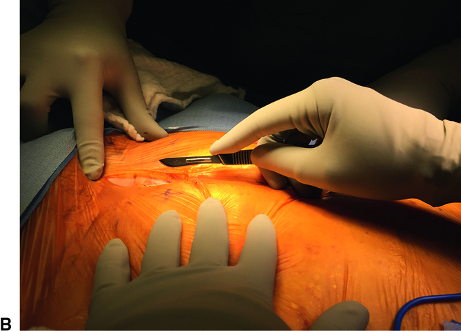
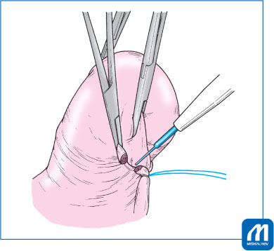
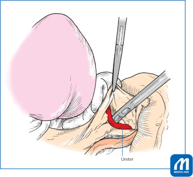
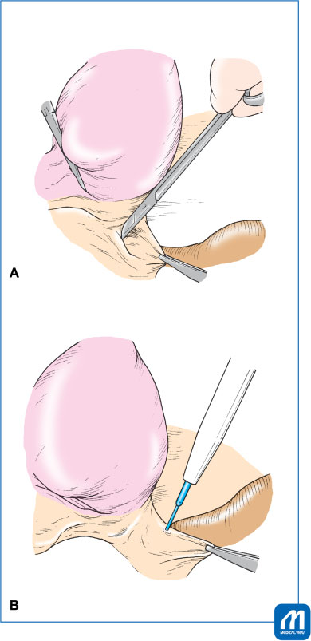
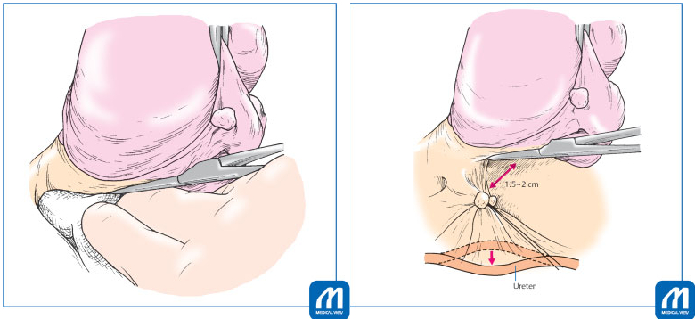
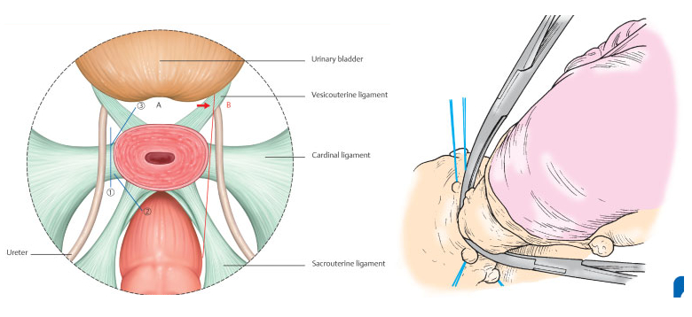
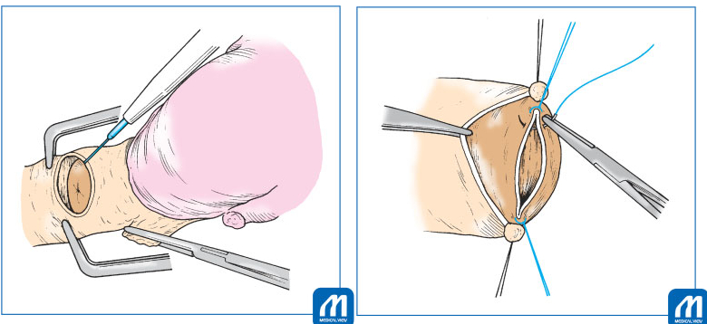
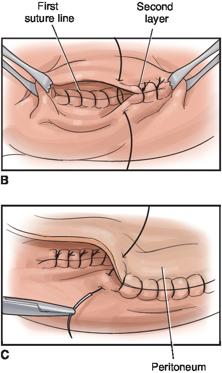
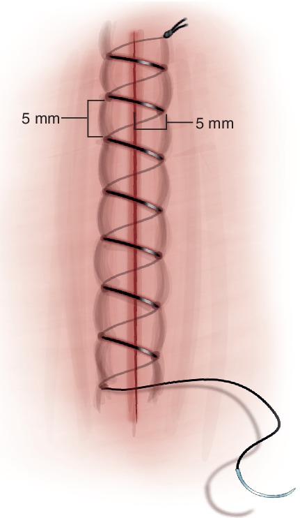

# Total Abdominal Hysterectomy (TAH) Operative Manual

## I. Preoperative Optimization

Thorough preoperative planning is essential for reducing intraoperative complications and expediting patient recovery.

* **Medical Management of Anemia & Fibroids:** Preoperative treatment with a GnRH analogue (e.g., depot leuprolide acetate) for 3–4 months is associated with reduced uterine volume, a decrease in intraoperative blood loss of approximately 200 mL, and reduced transfusion rates.
* **Laboratory Preparation:** Evaluate D-dimer levels; patients with large uterine fibroids or malignant tumors have a higher frequency of deep vein thrombosis.
* **Anatomic Prep for Complex Cases:** If intraligamentary or large cervical myomas are present, consider preoperative intravenous pyelography or ureteral stent placement due to the heightened risk of ureteral injury. Order autologous blood storage or cross-matched blood if severe adhesions are anticipated.
* **VTE Prophylaxis:** Evaluate the patient using the Caprini Risk Assessment Model to determine the need for sequential compression stockings, pharmacologic agents (like LMWH), or both.

---

## II. Surgical Instrumentation & Suture Selection

A precise understanding of surgical tools and suture properties ensures optimal tissue handling and secure hemostasis throughout the procedure.

### Scalpels & Scissors
* **#10 Blade:** Utilized for incising the skin, subcutaneous fat, and deeper fascial layers. Grasp the scalpel in an overhand grip with the index finger extended along the back of the blade.
* **Mayo Scissors:** Thick, slightly curved scissors utilized for cutting fascia or dense vascular pedicles.
* **Metzenbaum/Cooper's Scissors:** Metzenbaum scissors are reserved for delicate tissue dissection. Convex Cooper's scissors are ideal for safely mobilizing the bladder laterally.
* **Jorgenson Scissors:** Featuring a sharp curve, ideal for amputating the cervix at the vaginal vault.

*Figure 6.1B: Proper overhand technique for grasping the scalpel during abdominal entry.*

### Tissue Clamps
* **Heaney or Masterson Clamps:** Heavy, crushing clamps with ridges and teeth used to securely occlude parametrial tissue.
* **Zeppelin Clamps:** Noncrushing clamps with longitudinal and cross-hatched ridges designed to minimize tissue necrosis.

> [!CAUTION]
> **Clamp Placement:** Always apply curved hysterectomy clamps with the concave curve facing the uterus to prevent lateral migration toward the ureter.

---

## III. Abdominal Incision & Entry

Incision selection depends on the underlying pathology, uterine size, and necessary pelvic exposure.

* **Pfannenstiel Incision:** Provides superior cosmetic results and wound security. Avoid extending the fascial incision laterally into the oblique muscles to prevent nerve entrapment.
* **Cherney Incision:** Divides the rectus tendons at the symphysis pubis for wider pelvic exposure.
* **Midline Incision:** Offers rapid entry and the greatest versatility for complicated pathologies. Make the incision for the required length according to the size of the uterus.

---

## IV. Step-by-Step TAH Execution

### 1. Round Ligament Ligation
* Place a ligature in the round ligament using 1-0 absorbable suture approximately 1.5 to 2 cm away from the uterus.
* Clamp the uterine side with a Kocher's forceps to prevent backbleeding and cut the ligament.

*Figure 2: Ligate the round ligament approximately 1.5–2 cm away from the uterus.*

### 2. Retroperitoneal Access & Ureter Identification
* Incise the anterior leaf of the broad ligament across the vesicouterine peritoneal reflection.
* Grasp the posterior broad ligament, scrape off tissues with Cooper's scissors to thin it, and cut down toward the sacrouterine ligament. This maneuver keeps the ureter away from the uterine cervix.

> [!TIP]
> **Clinical Pearl: Tracing the Ureter in Difficult Cases**
> If strong adhesions or cervical/retroperitoneal fibroids are present, finding the ureter near the cervix causes bleeding and damage. The safest and most reliable method is to expose the common iliac artery by expanding the view with your index fingers, find where the ureter intersects it, and trace the ureter downward.

*Figure 16: Safe method to find the ureter by tracing it downward from the common iliac artery intersection.*

### 3. Adnexal Management
* **For Ovarian Preservation:** Isolate the utero-ovarian pedicle, clamp with a Heaney, transect, and secure.
* **Opportunistic Salpingectomy:** Recommended to potentially reduce lifetime risk of serous ovarian cancers by up to 80%. Ensure the entire fimbriated distal portion of the tube is freed and removed.

### 4. Bladder Mobilization (Center-to-Lateral Technique)
* The back of the bladder bleeds easily. Apply strong upward traction on the uterus.
* First, mobilize the bladder with Cooper's scissors exactly at the center of the cervix.
* Next, proceed with lateral blunt dissection using the convex Cooper's scissors to expose the vesicouterine ligament. Avoid drifting laterally into the bladder pillars, which causes troublesome bleeding.

*Figure 4: Mobilize the bladder at the center of the cervix (A), then dissect bluntly laterally with convex Cooper's scissors (B).*

### 5. Three-Step Parametrial Cutting (The "Roundness of the Cervix")
It is vital to cut sequentially from the ligament furthest from the ureter and maintain the cut along the physical roundness of the uterine cervix to avoid ureteral injury.

#### Step 1: Uterine Artery & Upper Cardinal Ligament
* Scrape away loose connective tissue to visualize the uterine artery.
* Open Heaney's forceps widely, slide them down tracing the cervical surface, and clamp close to 90 degrees. Apply a short Kocher's forceps on the uterine side creating a triangle with the Heaney's.
* Cut slightly beyond the tip of the Heaney's forceps. Ligate near the tip of the Heaney's with an absorbable suture.
* **The "Push-Down":** Compress the cut stump with gauze and push it down slowly 1.5 to 2 cm along the cervix. This moves the ureter further away from the cervix prior to the next clamp.

*Figures 8 & 9: Pushing down the ligated stump 1.5 to 2 cm to move the ureter safely away from the cervix.*

#### Step 2: Sacrouterine & Posterior Half of Cardinal Ligament
* Place one arm of the Heaney's forceps inside the sacrouterine ligament and the other against the posterior half of the cardinal ligament.
* Follow the roundness of the cervix; clamp diagonally behind the uterus. Cut and ligate.

#### Step 3: Vesicouterine & Anterior Half of Cardinal Ligament
* Place your hand against the back of the cervix to identify the boundary; if needed, push the bladder down another 1 cm.
* Clamp the vesicouterine ligament and anterior cardinal ligament so the convex surface faces diagonally in front of the uterus. Cut and ligate.
* **Checkpoint:** If done correctly, the ligated stumps will line up at the same level surrounding the cervix (following its roundness), avoiding the ureter completely.

*Figures 1 & 12: Proper alignment of ligated stumps around the roundness of the cervix prevents ureteral injury.*

### 6. Vaginal Cuff Closure
* Palpate the cervix front and back, then clamp the vaginal wall with right-angle or Heaney's forceps.
* Incise the anterior wall of the cervix with an electric knife, grasp the vaginal wall with Kocher's forceps, and remove the uterus.
* Suture the bilateral ends of the vaginal stump with 1-0 absorbable suture, then suture the remaining part continuously. Using absorbable suture prevents postoperative granulation.

*Figures 14 & 15: Incising the anterior vagina and closing the vaginal vault continuously.*

---

## V. Management of Intraoperative Complications

### A. Hemostasis Pearls (Bleeding Control)
* **Bleeding Behind the Bladder:** Suction well and apply bipolar coagulation. If bleeding does not stop after 2 to 3 attempts, **do not repeat coagulation** as this causes urinary fistulas. Immediately switch to Z sutures with 3-0 absorbable suture.
* **Bleeding from Pelvic Floor (e.g., retroperitoneal myomas):** If bipolar fails after 2–3 attempts, use Z sutures. If the area is dangerously close to the vascular plexus, apply a fibrinogen compound (Tacosil) followed by gauze pressure for 2 to 3 minutes. Insert a drain if there is concern for postoperative bleeding.

### B. Urinary Tract Injury
Maintain a low threshold for intraoperative cystoscopy if there is suspicion of urinary tract injury or distorted anatomy. Use intravenous colorants (e.g., indigo carmine or methylene blue) to confirm ureteral efflux.

* **Bladder Injury (Cystotomy):** Confirm injury via distension with colored saline. Perform a wide mobilization of the bladder wall to ensure a tension-free, two-layer closure (urothelium/detrusor followed by seromuscular layer). Decompress with a Foley catheter postoperatively for 7–10 days.

*Figure 37.13: Two-layer closure of a bladder injury with peritoneal flap covering.*

### C. Surgical Hemorrhage & Internal Iliac Artery Ligation
Apply immediate direct pressure. If arterial bleeding is uncontrollable, open the retroperitoneum and isolate the internal iliac artery. Pass a right-angle clamp strictly from **lateral to medial** (protecting the external iliac vein) to safely pass two delayed absorbable sutures for ligation (without division).

---

## VI. Abdominal Fascial Closure

Meticulous closure is paramount to preventing wound dehiscence and incisional hernias.

* Use a continuous, running mass closure with delayed absorbable monofilament suture.
* Maintain a Suture-to-Wound Length (SL:WL) ratio of $\ge 4:1$.
* Take "small bites"—placing the needle 5–8 mm from the fascial edge and advancing 5–8 mm per stitch.

*Figure 8.13: Close-up of the recommended "small stitches" (5 mm from the edge and 5 mm apart) for fascial mass closure.*

---

## VII. Enhanced Recovery After Surgery (ERAS)

Implementing ERAS protocols mitigates postoperative complications and shortens the hospital stay.

* **Early Feeding:** Initiate oral intake within 24 hours after surgery. This promotes faster return of normal bowel function and improves patient satisfaction compared to delayed feeding.
* **Catheter Removal:** Discontinue the indwelling urinary catheter no later than the morning after surgery (in the absence of urinary tract injury).
* **Ambulation:** Encourage ambulation on the afternoon or evening of the surgery. Pneumatic compression devices are no longer required once the patient is ambulating.